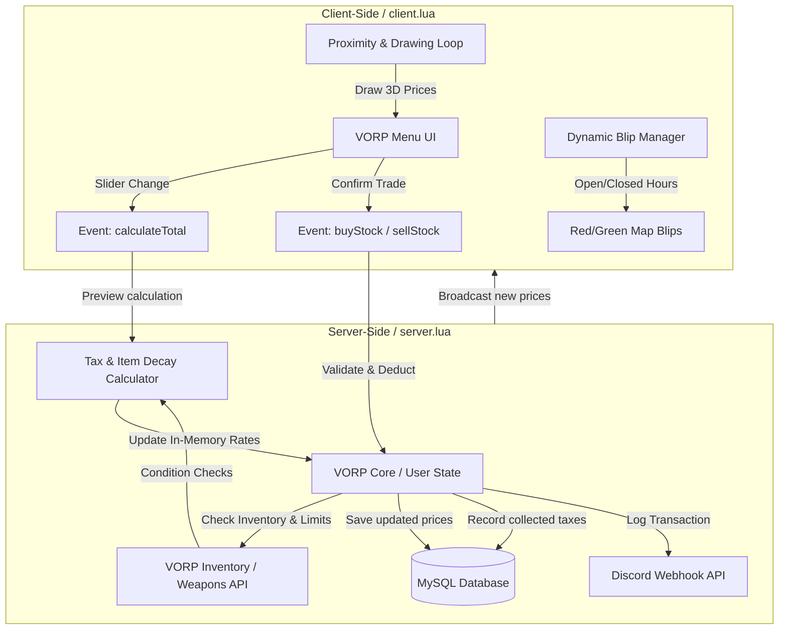

# 📈 gg_stockmarket - RedM Stock Market System

Professional, dynamic stock market system for RedM servers using **VORP Core**. Allow your players to trade goods and bonds with prices that fluctuate based on supply and demand.

---

## 🌟 Features

- **Dynamic Pricing**: Prices change automatically after each buy/sell transaction.
- **Multiple Trading Locations**: Set up specific markets (e.g., Vegetable Exchange, Raw Materials, Weaponry) with unique item lists.
- **Discord Integration**: 
  - Automatic market summaries sent to your Discord channel.
  - Detailed transaction logs (who sold what, where, and for how much).
- **Working Hours**: Configure specific opening and closing times for each market.
- **Tax System**: Automatically deduct a percentage from every sale.
- **Item Condition Support**: Prices can be affected by the item's condition/durability.
- **Multilingual**: Supports English and Lithuanian out of the box.
- **Optimized**: High performance with configurable cooldowns and clean code.

---

## 🛠️ Requirements

To run this script, you need the following resources:
- [VORP Core](https://github.com/VORP-Core/VORP-Core)
- [VORP Inventory](https://github.com/VORP-Core/VORP-Inventory)
- [VORP Menu](https://github.com/VORP-Core/VORP-Menu)
- [mysql-async](https://github.com/brouznouf/fivem-mysql-async) (or similar)

---

## 📐 System Architecture

This diagram illustrates how client interactions, server-side validation, database logging, and external integrations (Discord) communicate:



---

## 📥 Installation

1. **Download** the resource.
2. **Copy** the `gg_stockmarket` folder to your server's `resources` directory.
3. **Configure** the script in `config.lua` (set your Discord webhooks and language).
4. **Add** the following line to your `server.cfg`:
   ```cfg
   ensure gg_stockmarket
   ```
5. **Restart** your server or start the resource.

---

## ⚙️ Configuration (Explanations)

The `config.lua` file is highly customizable. Here are the key sections:

### General Settings
- `Config.Tax`: The percentage taken by the "state" from every sale.
- `Config.DecayTolerance`: The minimum item condition (0-100) required to get the full market price.
- `Config.Language`: Switch between `"en"` and `"lt"`.

### Market Locations
You can define multiple coordinates. Each location has:
- `stocks`: List of items available for trade at this specific spot.
- `StoreHoursAllowed`: Enable/Disable working hours.
- `StoreOpen`/`StoreClose`: Define the window when the market is accessible.

### Discord Webhooks
- `Config.webhookUrl`: Used for periodic market price summaries.
- `Config.transactionWebhookUrl`: Used for logging every player transaction.

---

## 🇱🇹 Lietuviškai (Trumpai)

Tai yra dinamiška akcijų biržos sistema skirta RedM serveriams.
- **Kainos keičiasi realiu laiku** pagal pirkimus/pardavimus.
- **Discord integracija** pranešimams ir logams.
- **Darbo valandos** ir mokesčių sistema.
- **Palaiko VORP Core**.

---

## 👨‍💻 Author
Created by **pauliusmed**

---

## 📄 License
This project is for use in RedM game servers. Please respect the author's work.
